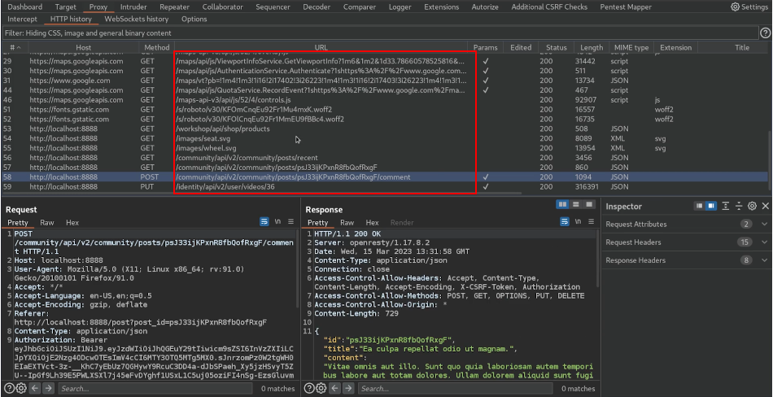
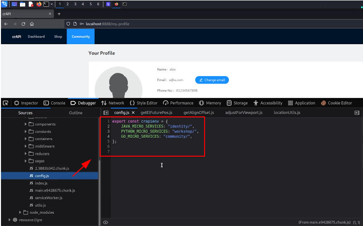
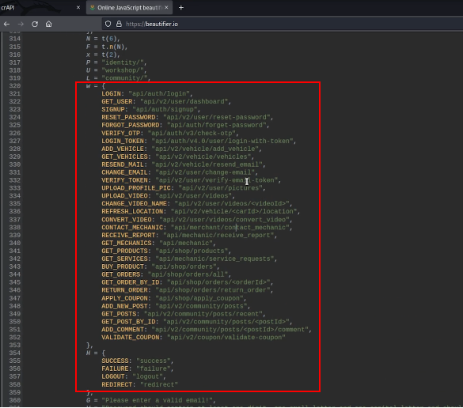
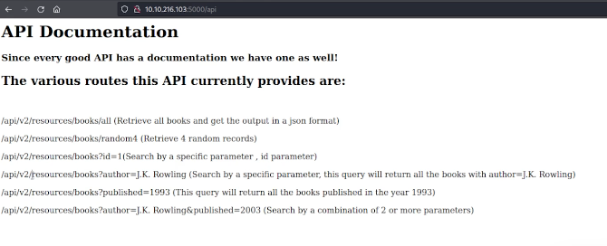
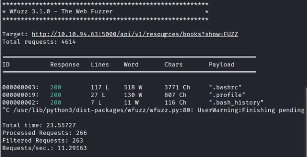
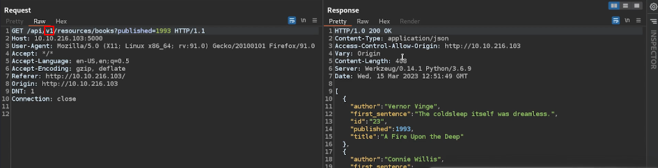
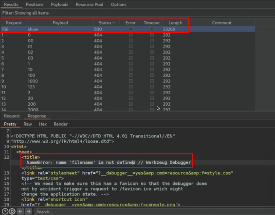
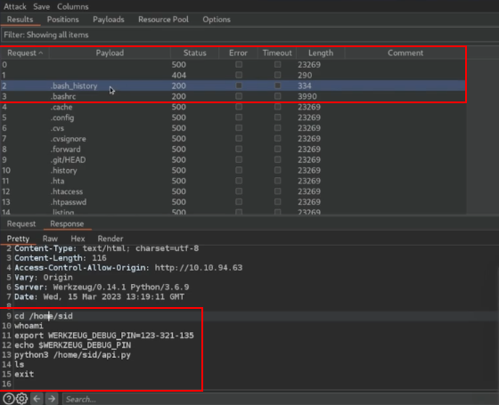

# Intro

Enumerating APIs in web penetration testing involves discovering and mapping an application's exposed endpoints to identify security weaknesses. This process includes inspecting API documentation, analyzing web traffic using tools like Burp Suite, and leveraging automated scanners. Common techniques involve fuzzing for hidden endpoints, reviewing JavaScript files, and analyzing error responses for unintended disclosures.

Attackers often target misconfigured APIs, excessive data exposure, and improper authentication mechanisms. API enumeration helps testers understand the application's attack surface, including HTTP methods, parameters, and authentication schemes. Rate limits and CORS policies are also assessed for potential exploitation. OpenAPI and GraphQL endpoints are prime targets for enumeration. Proper API versioning and deprecation policies are reviewed for security flaws. The goal is to find vulnerabilities that could lead to unauthorized data access or system compromise.

# Discovery via Source Code

One of the most effective ways to enumerate API endpoints is by analyzing the application's source code and monitoring network requests. This process helps uncover hidden functionality and undocumented endpoints that may be vulnerable.


#### Logging Requests with Burp Suite  

Start by navigating through the application while __intercepting and logging requests__ in Burp Suite. By analyzing the __HTTP history__, you can identify API calls made by the frontend.

- Explore the application as a normal user and perform various actions.
- Review __Burp HTTP history__ to track API endpoints and parameters.
- Identify recurring patterns, such as `GET /api/v1/data` or `POST /api/user/login`.
- Look for potential __hidden__ or __deprecated__ API endpoints.

Example of Burp Suite capturing API traffic:



---

#### Extracting API Endpoints from JavaScript Files  

Another method is __analyzing JavaScript files__ used by the frontend. These files often contain hardcoded API endpoints, authentication mechanisms, or useful debugging information.

- Search for __fetch()__, __XHR requests__, or __WebSocket connections__.
- Look for endpoint URLs, API keys, or debug parameters.
- Identify sensitive functions related to authentication, payments, or data exports.

Example of JavaScript containing API paths:



---

#### Formatted JavaScript Revealing API Details  

After formatting obfuscated JavaScript files, additional API details may be exposed, such as:

- __Endpoints__ for authentication, user actions, or data retrieval.
- __Response statuses__ (success, failure, logout, redirect).
- __Potential error messages__ that reveal backend structure.

Example of formatted JavaScript exposing API information:




# Fuzzing

Identify API documentation (if available) and endpoints to understand the application's structure. Use tools like Burp Suite Intruder, ffuf, or API-specific fuzzers to test for hidden or undocumented endpoints. Enumerate common API paths, such as /api/v1/, /private/, or /admin/, using wordlists tailored for API testing. 

Analyze HTTP response codes, headers, and body content to identify potential vulnerabilities or unexpected behavior. Test for various HTTP methods (GET, POST, PUT, DELETE) to determine how the API processes different requests. Pay attention to error messages, as they may reveal internal details or sensitive information. 

Implement parameter fuzzing to detect potential injection points, IDOR (Insecure Direct Object References), or access control flaws. Assess how the API handles malformed requests, unexpected data types, and large payloads. Evaluate rate limits and throttling mechanisms to determine if abuse is possible. Combine fuzzing with authentication testing to uncover privilege escalation or unauthorized access risks.



---

#### Using wfuzz for API Enumeration

The following `wfuzz` command can help discover hidden parameters by injecting a wordlist into the query string:

```bash
wfuzz -c -z file,/path/to/wordlist --sc 200 'http://0.0.0.0/path/to/endpoint?show=FUZZ'
```

- `-c`: Enables colorized output for better readability.  
- `-z file,/path/to/wordlist`: Uses a wordlist to test different values for the `FUZZ` parameter.  
- `--sc 200`: Filters results to only show responses with a `200 OK` status.  
- The target URL has `FUZZ` as a placeholder, which is replaced with words from the wordlist.  

Example output may reveal sensitive parameters or endpoints returning valid responses.



---

#### Fuzzing with Burp Suite  

Using Burp Suite, we discover that the `/api/` endpoint contains `v1/` and `v2/` versions:



This information suggests versioning, meaning older endpoints may still be accessible or vulnerable. Fuzzing different versions might reveal deprecated endpoints with security weaknesses.

Fuzzing `books?FUZZ=1993` results in a __Werkzeug error__, exposing a debug message:

```plaintext
NameError: name 'filename' is not defined // Werkzeug Debugger
```

This response can indicate improper input validation, potential file handling issues, or debug mode being enabled, which can be exploited further.



To check for possible file disclosure vulnerabilities, fuzz API parameters with common Linux filenames:

```http
GET /api/v1/resources/books?show=FUZZ
```



- Test with filenames like `.bash_history`, `/etc/passwd`, or application-specific files.  
- Look for different response codes or errors indicating file inclusion or path traversal issues.  


