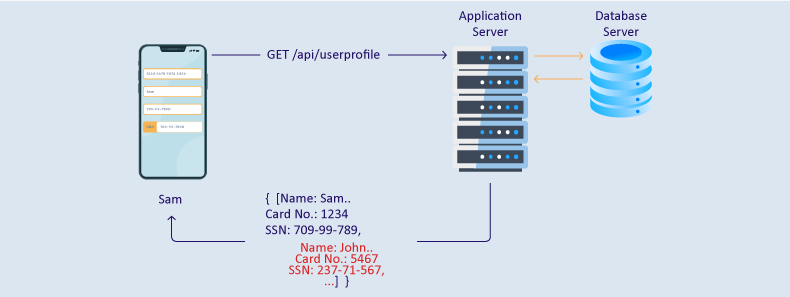
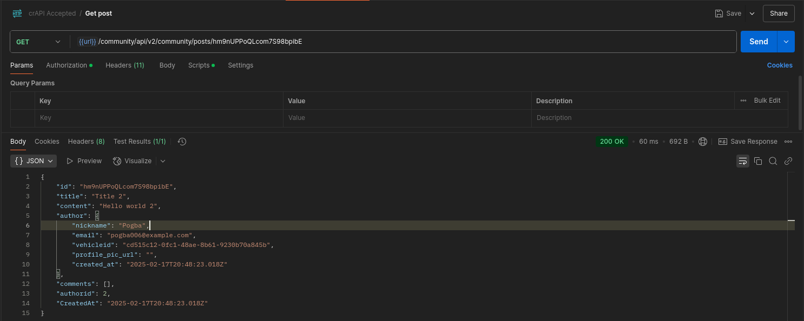

# Intro

Excessive Data Exposure refers to a vulnerability where APIs unintentionally reveal more information than necessary to users, often due to poor design or insufficient security awareness during development. This issue can arise when developers fail to adequately filter or restrict the data returned by the API, potentially exposing sensitive information.

A key factor in this problem is the reliance on the client to perform data filtering, which is inherently insecure. Without proper controls, APIs may expose unnecessary or sensitive data, increasing the attack surface.



A previous example of this comes from the crAPI application, where we identified a vulnerability involving vehicle IDs that could be exploited through excessive data exposure.


- __Threat agents/Attack vectors__: Exploitation of excessive data exposure is relatively simple, often performed by sniffing network traffic or analyzing API responses. Attackers may look for sensitive data that is being exposed unnecessarily, which could include emails, IDs, or other private details that should not be publicly accessible.

- __Security Weakness__: APIs often delegate responsibility for data filtering to clients. However, in many cases, API responses are designed to be generic, and developers may overlook the sensitivity of the data being returned. This vulnerability is challenging for automated tools to detect because it requires a deep understanding of the application's logic and context. Tools might struggle to differentiate between legitimate data and data that should remain confidential.

- __Impacts__: Excessive data exposure can result in unauthorized access to sensitive information, including personal data, passwords, or financial information. This exposure can lead to identity theft, data breaches, and increased attack surfaces for further exploitation.

# crAPI

An example of excessive data exposure occurs with a GET request to the `/community/api/v2/community/posts/recent` endpoint, where sensitive information about users is exposed in the API response.

Here, the API response discloses sensitive data about each post's author, including their email and vehicle ID, which should not be exposed in this context.

```json
{
    "posts": [
        {
            "id": "sxUnKJGQ87kwxxznHLHL2B",
            "title": "Title 3",
            "content": "Hello world 3",
            "author": {
                "nickname": "Robot",
                "email": "robot001@example.com",
                "vehicleid": "4bae9968-ec7f-4de3-a3a0-ba1b2ab5e5e5",
                "profile_pic_url": "",
                "created_at": "2025-02-17T20:48:23.024Z"
            },
            "comments": [],
            "authorid": 3,
            "CreatedAt": "2025-02-17T20:48:23.024Z"
        },
        {
            "id": "hm9nUPPoQLcom7S98bpibE",
            "title": "Title 2",
            "content": "Hello world 2",
            "author": {
                "nickname": "Pogba",
                "email": "pogba006@example.com",
                "vehicleid": "cd515c12-0fc1-48ae-8b61-9230b70a845b",
                "profile_pic_url": "",
                "created_at": "2025-02-17T20:48:23.018Z"
            },
            "comments": [],
            "authorid": 2,
            "CreatedAt": "2025-02-17T20:48:23.018Z"
        },
        {
            "id": "HQWsVCVbujVwmyqwuFEDB4",
            "title": "Title 1",
            "content": "Hello world 1",
            "author": {
                "nickname": "Adam",
                "email": "adam007@example.com",
                "vehicleid": "f89b5f21-7829-45cb-a650-299a61090378",
                "profile_pic_url": "",
                "created_at": "2025-02-17T20:48:21.979Z"
            },
            "comments": [],
            "authorid": 1,
            "CreatedAt": "2025-02-17T20:48:21.979Z"
        }
    ],
    "next_offset": null,
    "previous_offset": null,
    "total": 3
}
```

Now that we have this information, it can be used to interact with other API endpoints. Even if other endpoints are not inherently vulnerable, they may still expose sensitive data when provided with the information we've gathered. This is a perfect example of how multiple vulnerabilities can be chained together to escalate an attack, something that automated tools might fail to detect.


Another example of excessive data exposure can be seen when making a GET request to the `/community/api/v2/community/posts/{{post_id}}` endpoint, where similar sensitive information about the users is revealed.

